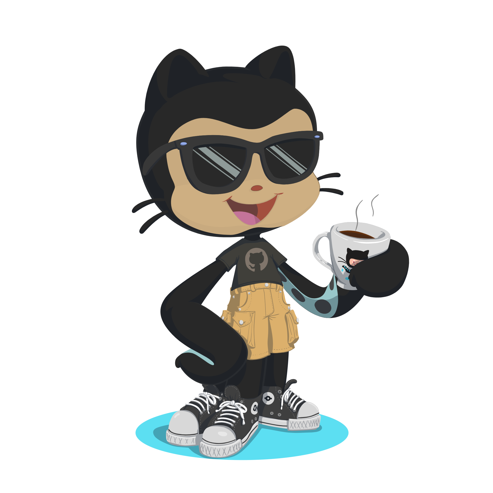

##

  

  👋 Hi there! I'm Gabriel, a Full Stack Developer at <a href="https://regexsolutions.com.br/" target="blank">Regex Solutions</a>, 
  working with Angular, TypeScript, Node.js, Sequelize, 
  and PostgreSQL to build web solutions for e-commerce and CRM platforms.

##

GitHub Stats:

  
   
  
  

##

&nbsp;Languages ​​and tools:

 
  
  
  
  
  
  
  
  
  
  
  
  
  
  
  
  
  
  
  

  
##
  

  
  
  
   

